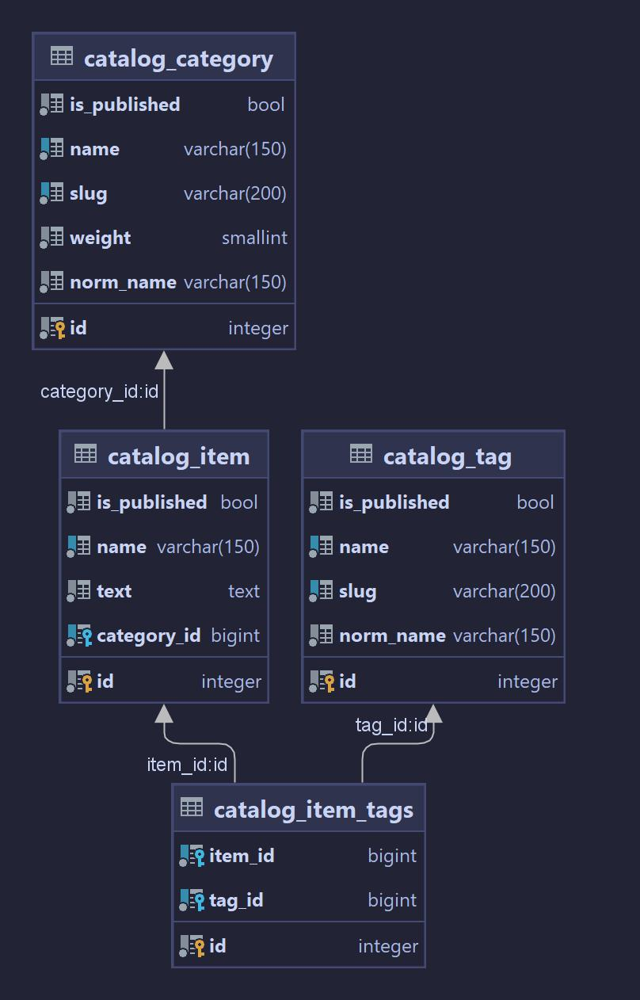

### Технологии которые были использованы

* Python 3.11
* Django 4.2

## Статус CI/CD

[](https://gitlab.crja72.ru/django_2023/students/49620-ochilov-timka-yandex.ru-47231/badges/main/pipeline.svg)

### Диаграмма базы данных


[

## Как установить

1. Клонирование репозитория:

   ```shell
   git clone https://github.com/ваш-пользователь/ваш-репозиторий.git
   ```
2. Создайние и активация виртуального окружения:

   ```shell
   python -m venv venv
   source venv/bin/activate
   ```
3. как устаносить зависимости:
    * prod:
       ```shell
       pip install -r requirements/prod.txt
       ```
   ___
    * dev:
       ```shell
       pip install -r requirements/dev.txt
       ```
   ___
    * test:
       ```shell
       pip install -r requirements/test.txt
       ```
4. Измените файл <*template.env*> на <*.env*> и подставьте значение ключа.
5. Для работы дальнейших пунктов 6 и 8, нужно перейти в папку lyceum
   ```shell
   cd lyceum
   ```
6. Миграция БД:

   ```shell
   cd lyceum
   ```
   ```shell
   python manage.py migrate
   ```

7. Процесс Запуска приложения:
   ```shell
   python manage.py runserver
   ```